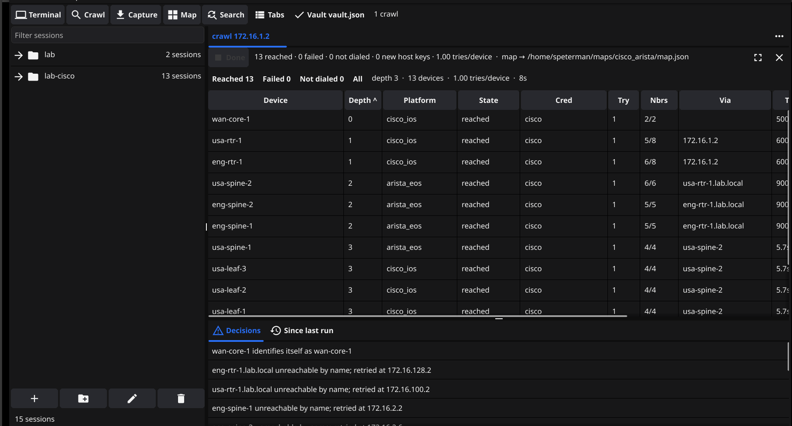
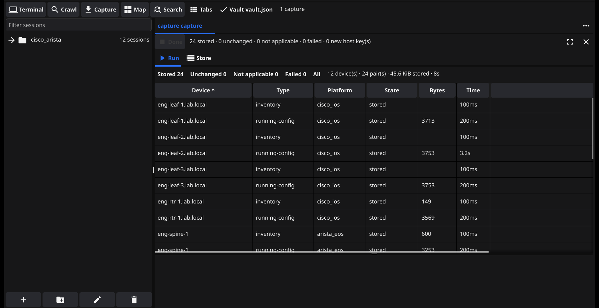
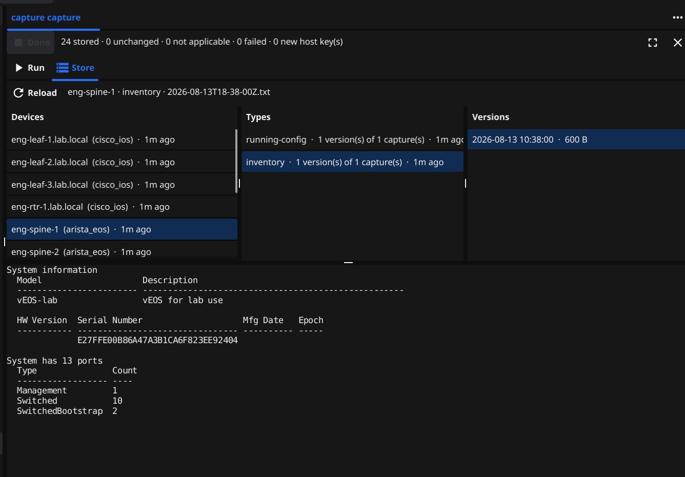
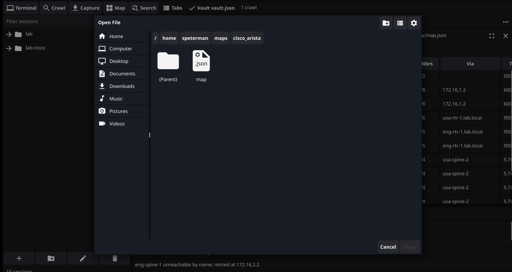
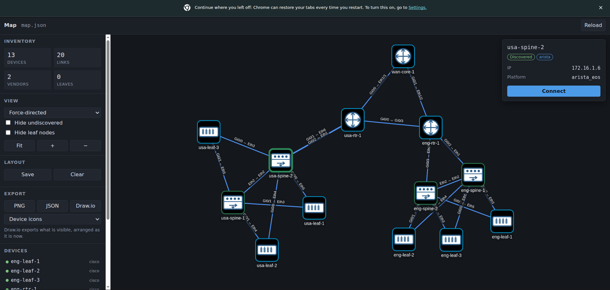
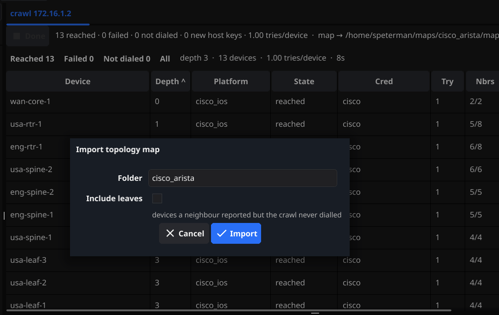

# PathfinderSSH: The Terminal That Maps Your Network

**Author:** Scott Peterman
**Date:** August 2026
**Status:** Working application — every pillar is standing. The whole loop,
crawl to map to click to session, runs end to end against real gear, and the
saved inventory it feeds is in place. Not yet packaged.

---

## What this is now

One window. A saved session tree down the left, and a terminal, a network
crawl, a config capture and a live topology map running at the same time, in
the same process, against real gear.

That sentence was a proposal until August 2026 and is now a screenshot. The
rest of this document is the argument for why it should exist; this section is
what actually runs.

**The shell** hosts an SSH/telnet/serial terminal, a discovery crawl, a
configuration capture, and the map. Each opens in a tab, and any of them can be
pulled out into a window of its own without dropping what it is doing. A
detached session is a *live* session: the transport, the read loop and the
screen buffer never notice the move.

<!-- TODO screenshot: a live SSH session detached into its own window (lab). -->

**Discovery** takes a seed device, fingerprints the platform, walks CDP/LLDP
neighbors breadth-first, and reports every device it reached, failed to reach,
or was told about but never dialed — with the credential that worked and how
many were tried to get there.

<!-- TODO screenshot: the crawl parameters dialog (lab). The completed run is
     the image at the top of this document. -->

**Capture** reads configuration and inventory from a device list into a
content-addressed store, and keeps the history. A second run of an unchanged
estate stores nothing and says so — which is the answer the tool exists to
give.

  
  

**The map** is what the crawl was for. Pick a map, and the topology opens with
vendor icons, interface-pair labels on every link, and the devices the crawl was
told about but never dialed drawn as what they are. It renders in a browser
rather than a widget, for the reason the whole product exists: a browser already
has a graph engine, a zoom and a print dialog, and none of that is worth
rebuilding.

  
  

**The session tree** is the saved inventory, docked down the left with a filter
over it: folders of devices, hand-organised, editable in the application or in
any text editor, because it is one readable YAML file. Discovery imports *into*
it. Re-import the same estate and only what is new is added — every name,
folder and setting already changed by hand is left exactly alone, because a
device is matched by its address rather than by whatever the crawler called it.

**And the loop closes.** Click a node — on the map, in the crawl result table,
or in the tree — and a session opens to it, platform already identified, in a
tab beside the crawl that found it. That is the thing this project was for, and
until August 2026 it was a `printf`.

---

## The vision in one sentence

A fast, single-binary terminal that does the most common things a network
engineer needs every day — connect, map, run, capture, find — in one
lightweight tool, at a price nobody has to think about.

## The gap

Write out the daily commons of network engineering and it gets stark:

- Connect to a device — through jump hosts, with credentials, including
  gear old enough to need legacy crypto
- See what's actually connected to what
- Run one command across many devices
- Grab a config and see what changed
- Find where a MAC or IP lives
- Identify what an unknown device even is
- Console into the dead one
- Paste configuration without melting the control plane

That is most of the job's mechanical surface. Today it is spread across a
session manager, a stale Visio diagram, an automation framework that
requires being a programmer, a config-backup server someone has to run,
and an NMS nobody opens voluntarily.

The lightweight tool that does the common 80% does not exist — and not
because it's hard. The market is structured against it. Vendors who could
build it sell enterprise platforms and won't offer a $10 tool that
undercuts a $100k contract. Open source solved every piece separately and
left the integration as homework. Terminal vendors decided terminals were
a finished category twenty years ago. The individual engineer — the person
with a company card and a ceiling of about a hundred dollars before
approvals kick in — was simply abandoned as a buyer. The demand didn't go
anywhere; the products did.

## The product

The core loop: **crawl → map → click → session.**

Point the tool at one seed device. It fingerprints the platform, walks
CDP/LLDP neighbors breadth-first, and draws the topology. The map is not a
report — it is the interface. Click a node and you get a terminal session,
with the platform already identified, paging already handled, jump path
already known.

That inverts the oldest piece of drudgery in the trade. A session tree is a
hand-maintained approximation of the network; discovery ships the real thing
and *imports into* the tree, so what you keep is authored and what you find is
merged in rather than overwriting it. Both halves of that are now built, and
the merge is deliberately timid: it adds what it has never seen and touches
nothing else.

As of August 2026 that loop runs whole: the crawl writes a map, the map opens in
a browser, a click on a node opens a session in the application. The click also
still works from the crawl result table, which is where it was proven first.

Around that loop, a genuinely good terminal: serial for the dead box,
paced paste for the fragile one, session logging, themes, and the speed
of a native Go binary with no runtime, no server, no agent, and nothing
to install beyond the app itself.

And because the engine underneath is one abstraction — dial, fingerprint,
run, parse, normalize — each additional daily-commons feature is the same
machinery pointed at a different question. Configuration capture is the
engine asking "what's your config." MAC/IP hunt is the engine asking "who
has this address," fanned across the map it already built. The feature
list converges instead of sprawling.

## Where it actually is

**Validated against real gear.** The SSH core, including legacy algorithms,
jump-host chaining and fail-closed host-key verification. Prompt-driven
command execution with deterministic output cleaning. Platform
fingerprinting by probing. The topology crawler, at production scale against
an 86-device multi-vendor fabric in a single day. Configuration capture,
including the unchanged-run case that proves the content hashing. The
terminal, in daily use as its author's primary tool.

**Working, and new enough to still be finding things.** The shell and its
applets. Detachable sessions. The credential vault, OS-keyring backed. The
session dialog covering all three transports. The capture store browser. The
interactive map, click-to-session from it, and draw.io export of whatever the
map is currently showing. The session tree, its YAML file, and the importers
that read a crawl's map or another terminal's session file into it.

**The pillars are up. What is left is the work that makes them feel like one
product** rather than five good parts: documentation, smoothing the workflow
between the surfaces, and a credential experience that behaves the same way
everywhere it is asked for. Import and export are not yet wired to a button.
Store packaging and MAC/IP hunt are still ahead. None of that is small, and
none of it is a question of whether the thing works.

Each architecture area has its own document; the index is in
[internal/README.md](internal/README.md). The shell in particular is written
up in [README_Shell_Arch.md](README_Shell_Arch.md), which is worth reading
before extending it — hosting a live widget that can move between windows
turned out to have four separate silent failure modes.

## Why this can exist now, and why us

Every load-bearing piece is a problem already solved and field-validated,
most of it running in production use today:

- **Transport:** a hardened Go SSH core — legacy algorithm support,
  jump-host chaining, fail-closed host-key verification — extracted from a
  terminal in daily use and validated the same day against live gear,
  including a FIPS-restricted switch and a decade-old router.
- **Execution:** prompt-driven command running with deterministic output
  cleaning, ported from years of Python discovery tooling.
- **Fingerprinting:** platform identification by probing, no
  configuration required.
- **Crawl and parse:** an SSH-only topology crawler with pre-vetted
  parsing templates, validated in one day at production scale against an
  86-device multi-vendor fabric.
- **Map rendering:** a viewer carried over from an earlier generation of this
  work — the icon resolution, the layout handling and the filters had already
  been argued with on real topologies before they arrived here.
- **The terminal itself:** in daily use as its author's primary tool.
- **The application:** one window that hosts all of it, proven against a
  live lab with a crawl, a capture and two sessions running at once.

The durable moat is none of the code — it is the accumulated field
knowledge inside it. The interface-name normalization table, the
per-platform command quirks, the parsing variants that only exist because
two real devices described the same link differently. That knowledge took
years to collect and cannot be shortcut, and it compounds with every
update.

## Scope

**Version one:** Cisco (IOS / IOS-XE / NX-OS), Arista EOS, Juniper Junos.
Windows first, via the Microsoft Store. Those three vendor families cover
the overwhelming majority of the enterprise and datacenter installed
base — and they are exactly what is built and validated today.

**Non-goals, stated plainly:**

- Not an NMS. No monitoring, no alerting, no server, no agents.
- Not the full breadth of the earlier discovery platform. No SNMP paths, no
  plugin surface, no viewer ecosystem. There is one viewer, it renders one
  thing, and the loop is the product.
- Not a config-diff product. Capture stores raw text and content hashes;
  comparing two captures is a different tool.
- Not perfect. At this price, a missing platform is a feature request,
  not a refund.

## The security stance

The imperfection budget does not apply everywhere. A network engineer's
forgiveness curve has a cliff exactly where a tool touches credentials
and production gear, and no price point buys grace past it. These
are non-negotiable and are built to a standard the rest of the product
doesn't need:

1. Credential storage done right — OS-backed, no plaintext path. Built.
2. Host-key verification that fails closed. A key mismatch is never
   overridable by convenience. Built, and a trust-on-first-use prompt that
   nobody answers resolves to *no*.
3. A crawler and a capture engine that are provably read-only: every command
   either can issue is on an exact-string allowlist, checked twice, and
   verified against a recording server that reports what actually went on the
   wire.
4. Never hang a device. Per-command timeouts, byte bounds, and a separate
   smaller concurrency lane for expensive commands.
5. The map viewer is the only part of the product that listens on a socket,
   and it is treated accordingly. The threat there is not the network — the
   listener is on the loopback address — it is that every other page in the
   user's browser can also reach `127.0.0.1`, and this one will open a session
   on request. So: a per-run token, an `Origin` check, a `Host` check that
   stops DNS rebinding, and opaque node identifiers, which mean the only hosts
   that surface can name are the ones in the map currently open. A click opens
   a confirmation dialog. It never opens a connection.
6. The session file is not a secret and is not allowed to become one. It stores
   a credential *reference* — a vault entry's name — and never a password or a
   passphrase, and importing somebody else's exported session file drops any
   password in it rather than adopting it. The file is readable on purpose; it
   is worth nothing to whoever reads it.

Everything outside that perimeter ships early and iterates.

## Market and goals

Roughly half a million people in the US alone hold network administration
or network architecture roles per BLS, with a global market several times
that — and they are a population that pays for tools (a leading
commercial terminal charges $99/seat to the same buyers; the beloved
tool-suites of an earlier era charged fifteen times that for less than
what the crawler does).

The price stays low — $10 — on purpose. Low price means no purchase
approval, no expectations cliff, no support burden that outgrows one
person, and the fastest possible spread. The distribution mechanism is
the product itself: one engineer posts the map of their own network with
the caption "a ten dollar terminal drew this," and that screenshot is the
marketing.

The goals are deliberately modest and honestly stated: this does not
build a fortune. It builds a reputation — with exactly the population
whose regard compounds into everything else. Adoption over revenue.
Reach over rent.

## Principles

- **Ship early; iterate in the open.** Store auto-update makes every
  imperfection patchable.
- **Closed source, open knowledge.** The binary is the product; the
  writing and the map screenshots are the marketing.
- **Update velocity is the copy protection.** A pirated copy is frozen;
  the real one keeps absorbing field knowledge. DRM effort goes into
  shipping speed instead.
- **One engine, many questions.** No feature enters unless it is the
  dial-fingerprint-run-parse loop pointed somewhere new.
- **The engine never imports a toolkit.** Every package that talks to a
  device is testable without a display; the Fyne layer is a consumer, never
  a dependency. It is what lets the same engine serve a CLI, a window, and
  whatever comes next. The session tree is the clearest case: the file format,
  the folder rules, the merge and both importers are one package with no
  toolkit in it, and the panel on the left is a renderer over that.
- **The price stays low.** It's the strategy, not a compromise.