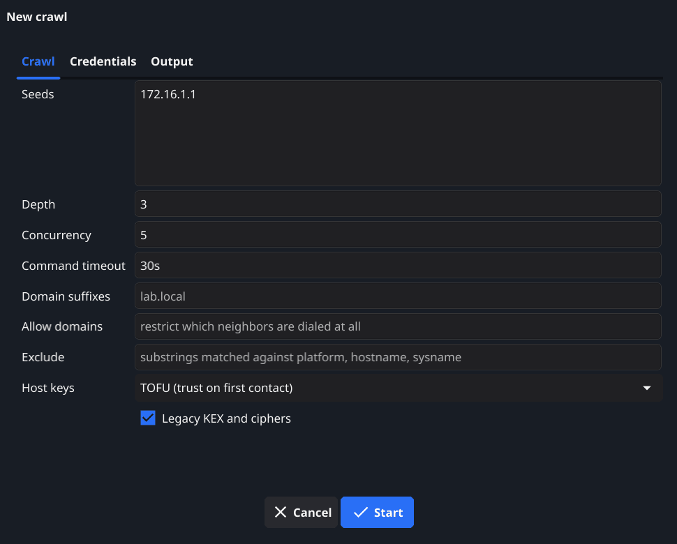
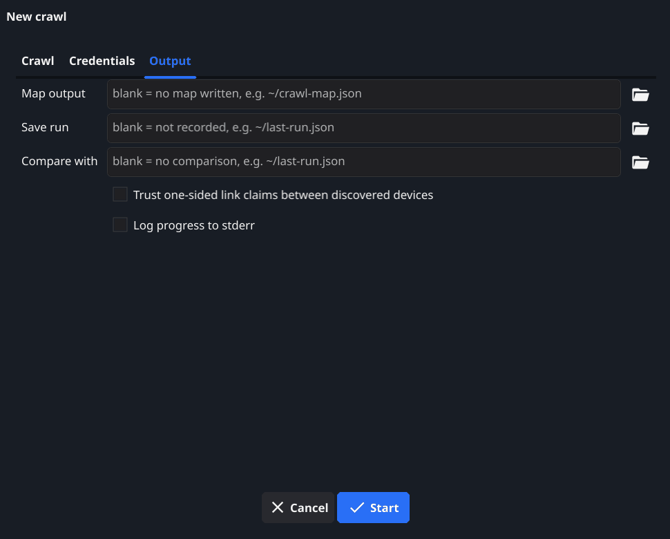
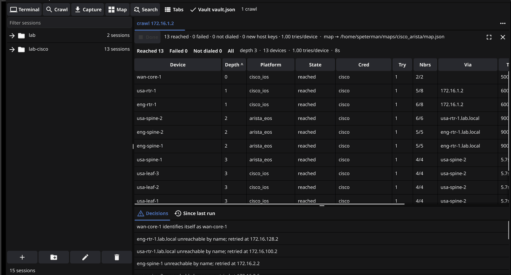
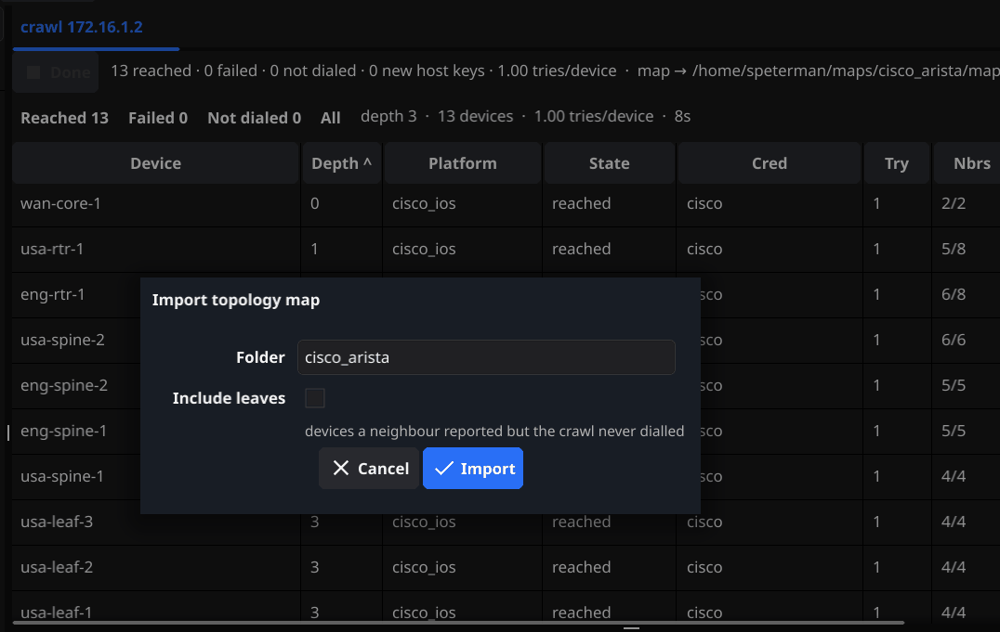
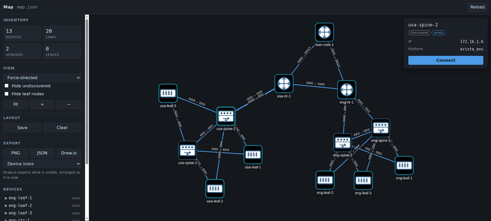
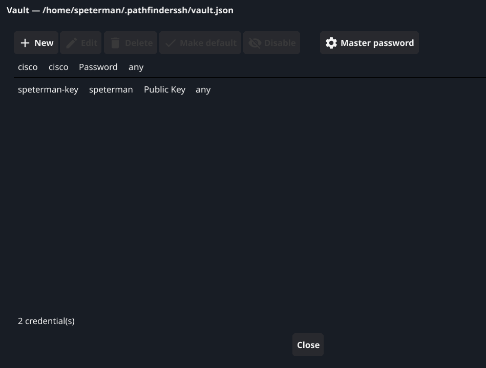
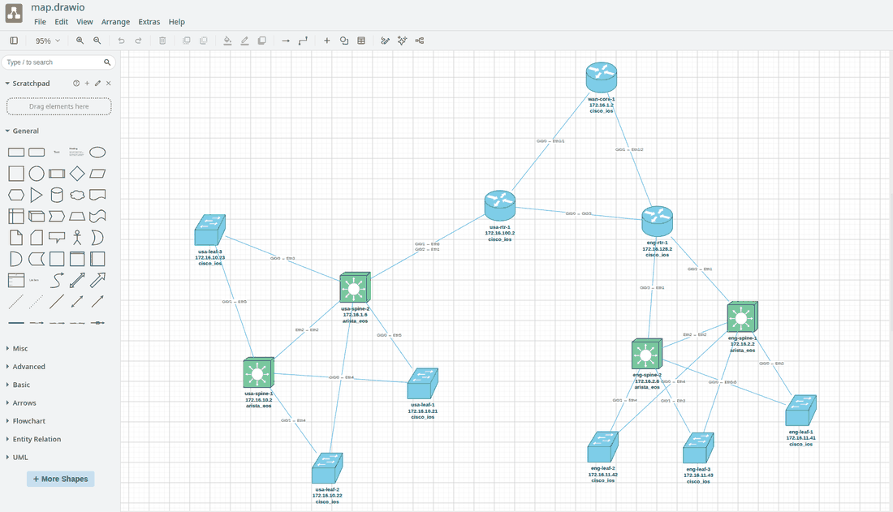
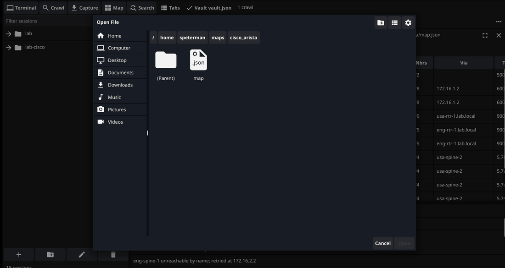
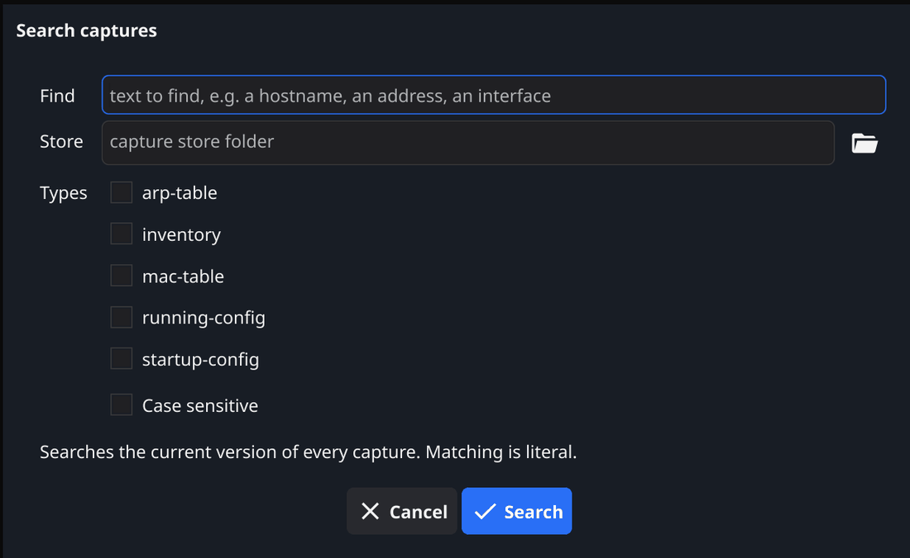
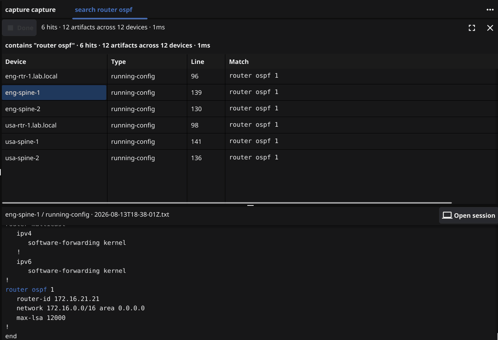

# PathfinderSSH — User Guide

  

This is the same documentation the application ships in **Help → Contents**,
as one page. The in-app copy is rendered from
[`internal/help/content/`](internal/help/content) into a self-contained HTML
file with its images inlined, so it works with the network unplugged; this
file is that content read on the web instead.

If you are starting from nothing, read [Quickstart](#quickstart) — it takes one
device you can already reach and turns it into a mapped network with a
searchable configuration baseline, in about ten minutes. Everything after it is
reference.

**Nothing in this program writes to a device.** Every command it sends is a
read, and the capture commands are on an allowlist enforced by the build.

## Contents

- [Quickstart](#quickstart)
- [Sessions and the session tree](#sessions-and-the-session-tree)
- [Credentials and the vault](#credentials-and-the-vault)
- [Crawl](#crawl)
- [The map](#the-map)
- [Capture](#capture)
- [Search](#search)
- [Settings](#settings)

---

## Quickstart

PathfinderSSH is a terminal, a discovery crawler, a configuration store and a
map, in one program on your laptop. There is no server to stand up, no agent to
install on a device, and nothing is written to your network — every command it
sends is a read.

This walkthrough takes one device you can already reach and turns it into a
mapped network with a configuration baseline you can search. It takes about ten
minutes.

### The order matters

Each step proves something the next one assumes:

1. **Add a session for one device** — a seed you know is reachable.
2. **Connect to it.** This proves the address, the credentials and the
   transport before anything larger depends on them.
3. **Put those credentials in the vault**, so the crawl and the capture can use
   them without being handed a password each time.
4. **Crawl from that seed.** The crawler logs in, reads neighbours, and walks
   outward.
5. **Import the map into the session tree.** Every device found becomes a
   session you can open.
6. **Capture** running-config and inventory across those sessions.
7. **Search** the captures, and open the map whenever you want it.

Most first-run problems are step 2 wearing a disguise: a crawl that reaches
nothing is usually a credential or a transport question, not a crawl question.
Doing step 2 on its own is what keeps those separate.

### 1. Add a session for the seed

Use the **+** button under the session tree. The only fields that matter now
are the name, the host and the transport.

Pick a seed with a wide view of the network. A core or distribution device
knows about far more neighbours than an access switch does, so the crawl
reaches more of the estate from fewer hops.

### 2. Connect

Open the session. If you land on a prompt, everything downstream will work.

If you do not:

- **Authentication failed** — the credentials are wrong, or the device wants
  keyboard-interactive and you supplied a key. Try the username and password
  directly in the session first.
- **Connection refused or timed out** — the address or the port, not the
  credentials.
- **No matching key exchange method / no matching cipher** — the device is
  older than the defaults. Tick **Allow legacy KEX/cipher/MAC** on the
  session's Advanced tab. See [Sessions](#sessions-and-the-session-tree).

### 3. Add the credentials to the vault

**Vault → Manage credentials**. Add the username and password that just
worked, and make it the default so runs that name no credential still have one.

The vault is a single encrypted file. A crawl or a capture asks it for a
credential per device, so you set this up once instead of typing it per run.
See [Credentials and the vault](#credentials-and-the-vault).

### 4. Crawl from the seed

**Crawl** on the toolbar. Three fields matter:

- **Seeds** — the address you just connected to.
- **Legacy KEX and ciphers** — tick it if that session needed it.
- **Map output**, on the **Output** tab — a path you will remember.

Depth is how many hops from the seed the crawler may travel; the default of 3
covers a small estate comfortably. Everything else can be left alone for a
first run.

**Map output has no default, and blank means no map is written.** The run looks
exactly the same either way: devices are reached, the table fills in, the run
reports success — and there is nothing at the end. The map is what the next two
steps are built from, so a crawl without it has to be run again from scratch.
Fill it in before you press Start.

The run table fills in as devices are reached. The **Decisions** pane under it
explains anything surprising, including devices that were unreachable by name
and retried by address.

### 5. Import the map into the session tree

**File → Import topology map**, and pick the `map.json` the crawl wrote. Give
the folder a name — the estate, the site, the customer.

Every discovered device becomes a session, with its address and platform
already filled in. Importing again later merges: devices that are still there
keep their settings, new ones are added.

**Include leaves** brings in devices a neighbour mentioned but the crawl never
logged into. They are real devices, but nothing has confirmed how to reach
them, so leave it off for a first import.

### 6. Capture configurations

**Capture** on the toolbar. Now that the tree is populated, point the capture
at the sessions rather than typing a device list:

- **Session file** — your `sessions.yaml`.
- **Match sessions** — `*` for everything, or a glob like `eng-*`.
- **Types** — tick `running-config` and `inventory`. `arp-table` and
  `mac-table` are there too, and cost nothing extra to add; they keep a rolling
  five versions rather than a full history, because they change on their own.
- **Store** — a directory. It is created if it does not exist.

Each device is dialled once and every selected type is read over that one
session. Nothing is written to any device.

Run it again tomorrow and anything unchanged is recorded as unchanged rather
than stored again, so the store becomes a history of what actually changed.

### 7. The map, and finding things

The map opens in your browser from the **Map** button, any time after a crawl —
it reads the `map.json` file, so it does not need the crawl to still be
running. Click a node and you can connect straight to that device.

**Search** greps every captured configuration in the store. Searching for an
address, a VLAN, a neighbour or a route-map answers "where is this configured"
across the whole estate in a few milliseconds, and a hit opens a session on the
device that has it.

### Where things live

| What | Where |
| --- | --- |
| Sessions | `~/.pathfinderssh/sessions.yaml` |
| Vault | `~/.pathfinderssh/vault.json` |
| Settings | `~/.pathfinderssh/settings.json` |
| Transcripts | `~/.pathfinderssh/logs` |
| Captures | wherever you set **Store** |
| Maps | wherever you set **Map output** |

**Settings → Paths** shows the paths this build actually resolved, with a Copy
button. That page answers "which file is it really using", which is a different
question from "which file should it be using".

---

## Sessions and the session tree

A session is one device: how to reach it, how to authenticate, and how its
terminal should behave. Sessions live in a YAML file you can read, diff and
keep in version control.

The tree on the left holds them in folders. The buttons underneath add a
session, add a folder, edit the selection, and delete it. Folders come from
however you think about your network — by site, by role, by customer.

Sessions arrive three ways: typed in by hand, imported from a topology map
after a crawl, or imported from an existing session file. An import **merges**
rather than replaces, so re-importing after a second crawl adds what is new and
leaves what you have edited alone.

### Connection

| Field | What it does |
| --- | --- |
| Name | What the tree and the tab show. Free text; it does not have to match the device's hostname. |
| Transport | `ssh`, `telnet` or `serial`. The fields below change to match. |
| Host | Address or hostname. |
| Port | Defaults to 22 for SSH, 23 for telnet. |
| Username | Login user. Blank falls back to the vault credential, then to your OS username. |
| Vault credential | Use a stored credential instead of typing one. `(none — manual auth)` uses the fields on this tab. |
| Auth type | `agent` uses your SSH agent, `key` a private key file, `password` a password. Agent first, then key, then password is the order attempted. |
| Password | Never written to the session file. It is held for this connection only. |
| Key path | Private key file, for `key` auth. |
| Key passphrase | Also never written to the session file. |

For **serial**, Host becomes **Serial port** and the line settings appear:
Baud, Data bits, Stop bits and Parity. This is the console-cable path, and it
works when nothing else does.

### Terminal

Everything here overrides the application default for this session only.
`(inherit)` and a blank field both mean "use the application setting", which is
what you want almost everywhere — set the exception, not the rule.

| Field | What it does |
| --- | --- |
| Terminal theme | Colour palette for this session's terminal. Independent of the application theme. |
| Font size | Point size. Applies when the tab is opened; an open session keeps the size it measured its grid at. |
| Scrollback lines | How much history the terminal keeps. |
| Terminal type | The `TERM` value sent to the device. `xterm-256color` suits nearly everything. |
| Paste line delay (ms) | A pause between pasted lines. Zero is full speed. |
| Warn at paste lines | Show a confirmation before pasting more than this many lines. Zero disables the warning. |
| Console line speed | Throttles output to a rate a console server can keep up with. `(full speed)` for network connections. |
| Logging | Write a transcript of this session to the transcript directory. |
| Anti-idle | Send a harmless keystroke after a quiet interval so an `exec-timeout` does not reap a session you are reading. |
| Anti-idle interval (s) | How long counts as quiet. |

The paste controls exist because a device is not a text editor. A router
processing a hundred lines of configuration pasted at full speed can drop
characters silently, and the result is a configuration that is subtly not what
you pasted. If you paste blocks into gear that has ever mangled one, set a
small line delay here.

### Advanced

| Field | What it does |
| --- | --- |
| Host key policy | How an unrecognised host key is treated. See below. |
| known_hosts path | Which file host keys are read from and written to. Blank uses `~/.ssh/known_hosts`. |
| Algorithms | **Allow legacy KEX/cipher/MAC** enables key exchanges and ciphers that modern SSH refuses. |
| Connect timeout (s) | How long to wait for the connection to establish. |
| Jump host | Connect through this host first. Blank means a direct connection. |
| Jump port / username / credential / key path / key passphrase | The same authentication choices, for the jump host. |
| Vendor / Model / Device type / Notes | Free text for your own reference. Never used to pick a code path — the platform is detected from the device. |

#### Host key policy

**TOFU** — trust on first use — accepts a key it has never seen and remembers
it. **Strict** requires the key to already be known.

Both refuse a key that has **changed**. That is the case that matters: a
changed key is the one that might be an interception, and every policy except
`insecure` stops for it. TOFU only relaxes the first meeting, which for a
network you administer is a device you have simply not connected to yet.

#### Legacy algorithms

Off by default, and available per session. Older network equipment negotiates
key exchanges and ciphers that current SSH implementations no longer offer, and
the failure reads as "no matching key exchange method found". That gear is
still in service, still needs configuring, and often needs it most when
something is broken.

Turning this on for the sessions that need it is a deliberate, per-device
decision. That is why it is not a global default.

---

## Credentials and the vault

The vault is one encrypted file holding the logins your sessions, crawls and
captures use. **Vault → Manage credentials** opens it.

A crawl reaching a hundred devices cannot stop to ask for a password a hundred
times, and typing one into a run dialog puts it in a field that is easy to
leave filled in. The vault is how a run gets a credential without either.

### The fields

| Field | What it does |
| --- | --- |
| Name | What you call this credential. It is what a session's **Vault credential** dropdown shows. |
| Username | The login user. |
| Auth | Password, or a public key. |
| Tags | Optional labels. A run can ask for only credentials carrying particular tags. |
| Scope | Which devices this credential may be offered to. `any` is every device. |

**Make default** marks one credential as the one used when nothing more
specific applies. A run that names no credential and no tag still has something
to try, which is what makes the crawl in the Quickstart work with no
credential configuration at all.

**Disable** keeps a credential without offering it. Useful for one that has
been rotated but might need to come back.

**Master password** changes the password protecting the file.

### How a run picks one

For each device, in order:

1. A credential explicitly named on the session.
2. Credentials matching the run's **Credential tags**, in priority order.
3. The default credential.
4. Anything typed on the run dialog's Credentials tab.

Several credentials can be tried per device — a key first, a password as
fallback. If you rely on that ladder and use tags to select it, **give every
rung the same tag**. A tag filter requires a credential to carry all the tags
asked for, so two rungs with different tags have no single tag value that
selects both, and the second is silently never offered.

### What is stored, and what is not

The file holds credentials encrypted with a key derived from your master
password. The master password itself is never written anywhere — a wrong one is
detected by the decryption failing, not by comparing against a stored copy.

Passwords and key passphrases typed into a **session** are not written to the
session file at all. They exist for that connection and are gone when it
closes. This is why the session file is safe to keep in version control and the
vault is not.

---

## Crawl

A crawl starts at one or more devices you can reach, logs in, reads what each
one knows about its neighbours, and works outward. The result is a topology map
and a list of every device it reached.

It only ever reads. There is no configuration path in this program at all.

### Before you start

Three fields decide whether a crawl produces anything, and two of them are easy
to leave alone because the run looks identical either way:

1. **Seeds** — where it starts. Without one there is nothing to crawl.
2. **Legacy KEX and ciphers**, on the same tab — if any of your gear predates
   the current SSH defaults, this is the difference between that half of the
   estate answering and none of it answering.
3. **Map output**, on the Output tab — **it has no default.** Left blank, the
   crawl runs, reaches every device, reports success, and writes no map.

The rest of the dialog is tuning. These three are the run.

### Crawl tab

| Field | What it does |
| --- | --- |
| Seeds | Where to start. One per line or comma separated. |
| Depth | How many hops from a seed the crawl may travel. |
| Concurrency | How many devices are dialled at once. |
| Command timeout | How long a single command may take before that device is given up on. |
| Domain suffixes | Suffixes to strip from discovered names, e.g. `lab.local`. Keeps `eng-leaf-1` and `eng-leaf-1.lab.local` from being treated as two devices. |
| Allow domains | Restricts which neighbours are dialled at all. Anything outside these domains is recorded but not visited. |
| Exclude | Substrings matched against platform, hostname and sysname. A match is skipped. |
| Host keys | TOFU or Strict — see [Sessions](#host-key-policy). TOFU is the default here. |
| Legacy KEX and ciphers | Allow older key exchanges and ciphers for this run. |

**Depth** is the control worth understanding. Depth 1 is the seed's immediate
neighbours; depth 3 typically covers a small site; a large estate wants more.
Depth is also the cheapest way to bound a first crawl of a network you do not
know yet — start shallow, look at what came back, go deeper.

**Allow domains** and **Exclude** are how you keep a crawl inside your own
estate. A neighbour table on a peering edge will happily name devices belonging
to somebody else, and neither you nor they want you dialling them.

Host keys defaults to **TOFU** here, unlike a capture. A crawl exists to meet
devices it has not met before, so requiring every key to already be known would
mean the first crawl of a new estate fails on every device.

### Credentials tab

| Field | What it does |
| --- | --- |
| Credential tags | Only vault credentials carrying all of these tags are offered. Blank offers everything. |
| Username / Password / Key file | Credentials for this run, when you are not using the vault. |
| known_hosts | Which file host keys are checked against. |

There is no vault field here on purpose. The vault is unlocked once, by the
application; a path typed into a run dialog would have to be opened again on
the run's own goroutine, with nowhere to ask for a master password.

### Output tab

| Field | What it does |
| --- | --- |
| Map output | Where `map.json` is written. **Blank writes no map.** |
| Save run | Records this run for a later comparison. Blank records nothing. |
| Compare with | A previous run file. The result shows what changed since. |
| Trust one-sided link claims between discovered devices | Keep a link only one of the two devices reported. |
| Log progress to stderr | Verbose output, for when something is going wrong. |

**Map output is blank by default, and that is the mistake worth naming.** The
run looks identical, the table fills in, everything succeeds — and there is no
map at the end, and no way to produce one except by crawling the estate again.
Fill it in before you start, every time.

The map is also what the session tree is built from, so a crawl with no map
output leaves you with nothing to import and no devices to capture from.

**Save run** and **Compare with** together answer "what changed since last
time": which devices appeared, which went away, which neighbours moved. Point
Compare with at the file a previous run saved.

**Trust one-sided link claims** decides what to do when device A reports a link
to device B but B does not report it back. That happens legitimately — a device
running only CDP next to one running only LLDP, or a neighbour whose table has
not aged out yet. Off is the conservative reading: a link both ends agree on is
a link. Turn it on when you know the estate is mixed and the map looks sparser
than the network is.

### Reading the result

The table has a row per device: the depth it was found at, the platform
detected, whether it was reached, which credential worked, how many attempts it
took, its neighbour count, and which device it was reached via.

**Decisions** underneath is the part to read when something looks wrong. It
records the judgements the crawl made — a device that identified itself under a
different name than expected, a name that would not resolve so the crawl
retried by address, a neighbour that was skipped. These are the things that
would otherwise be invisible in a run that reports success.

**Since last run** shows the comparison, when **Compare with** was set.

### After the crawl

The map file is the durable output. **File → Import topology map** turns it
into sessions; the **Map** button opens it in a browser. Both read the file, so
neither needs the crawl to still be running — the map is viewable any time
after.

---

## The map

The **Map** button opens the topology from a crawl in your browser. It reads a
`map.json` file, so it works any time after a crawl — the run does not have to
still be open, and a map from last month opens the same way as one from five
minutes ago.

The browser is only a renderer here. The page is served by the application
itself, to your own machine, and nothing about your network leaves it.

### Getting around

**Force-directed** arranges the graph automatically. Drag nodes to fix them
where they make sense to you, then **Save** the layout — it is remembered for
that map, so the picture you arranged is the picture you get back.

**Hide undiscovered** and **Hide leaf nodes** thin out a dense map. A leaf is a
device a neighbour mentioned but the crawl never logged into — real, but known
only by hearsay.

Clicking a node shows what was learned about it: its address, its detected
platform, whether it was discovered or only mentioned. **Connect** opens a
session on that device, in the application, from the map.

### Export

| Export | What you get |
| --- | --- |
| PNG | An image of the map as arranged. |
| JSON | The map data. |
| Draw.io | An editable diagram. |

The Draw.io export exports **what is visible, arranged as it is now** — so hide
what you do not want, arrange it the way you want it read, and then export.
Nodes carry their name, address and platform, and links carry the interfaces on
each end.

This is the path from "the network as discovered" to "a diagram somebody can be
handed", without redrawing anything by hand.

### Importing into the session tree

**File → Import topology map** turns a map into sessions.

**Folder** names the tree folder the devices land in. **Include leaves** brings
in the devices that were only mentioned by a neighbour — they will need an
address and credentials confirmed before they connect, so leave it off unless
you specifically want placeholders to fill in.

Importing the same map again merges. Devices you have edited keep their
settings; devices that are new are added.

---

## Capture

A capture reads state from a list of devices and stores it. Configuration
backup is the obvious use, but the design is not configuration-shaped —
anything worth reading on a schedule fits.

Every command a capture can run is on a read-only allowlist that is enforced by
the build. Nothing here writes to a device.

### Capture types

| Type | What it reads | Versions kept |
| --- | --- | --- |
| `running-config` | The active configuration. | All of them. |
| `startup-config` | The saved configuration — what the device comes back as. | All of them. |
| `inventory` | Chassis, modules and serial numbers. | All of them. |
| `arp-table` | IP to MAC resolution, as the device currently holds it. | The last five. |
| `mac-table` | Which MAC address was last seen on which port. | The last five. |

The first three change when somebody changes something. An unchanged run of one
stores nothing, so the history stays short by itself and none of it is ever
thrown away.

The last two change because time passed. Every capture of an ARP table differs
from the one before it, so every run writes a file — which is why they keep a
rolling five versions per device and drop the oldest as a new one lands. That
bound is a property of the type, not a setting: configuration history is never
pruned, and a nightly capture of a table that moves on its own does not grow
without end.

`arp-table` and `mac-table` answer the question a configuration cannot — which
port is this MAC on, which IP was that — and they cost nothing extra to collect,
since every type you tick is read over the one session already open.

### Capture tab

| Field | What it does |
| --- | --- |
| Devices | Addresses or names, one per line or comma separated. |
| Device file | A file of device names. `#` starts a comment. |
| Session file | Your `sessions.yaml`, as the device source. |
| Match sessions | Globs selecting from that session file, e.g. `*`, `eng-*`, `*-sw-*`. Matches a session name or its host. |
| Types | Which captures to take, from the five above. Nothing ticked means the default, `running-config`. |
| Store | Directory the captures are written to. |
| Domain suffixes | Suffixes stripped from device names, so one device does not file itself under two. |
| Host keys | Strict or TOFU. **Strict is the default here.** |
| Legacy KEX and ciphers | Allow older key exchanges and ciphers for this run. |

The three device sources are alternatives. Once the tree is populated from a
crawl, **Session file** plus **Match sessions** is the one to use: a glob keeps
meaning the right thing as the estate grows, where a typed list goes stale the
first time a device is added.

Host keys defaults to **Strict**, the opposite of a crawl. A capture works from
a list of devices somebody already administers, so a key nobody has seen before
is a question worth stopping for. A crawl, by definition, is meeting devices
for the first time.

### Limits tab

| Field | What it does |
| --- | --- |
| Concurrency | How many devices are captured at once. |
| Expensive concurrency | A separate, smaller lane for commands marked expensive. |
| Command timeout | How long one command may take. |
| Log progress to stderr | Verbose output. |

Each device is dialled **once** and every selected type is read over that one
session, cheapest first. Expensive commands run in their own narrow lane so one
slow command on one device cannot starve the run.

### Credentials tab

The same fields as a crawl: **Credential tags**, **Username**, **Password**,
**Key file**, **known_hosts**. See [Credentials and the vault](#credentials-and-the-vault).

### Reading the result

Every row is a **device and type pair**, not a device — one row for
`eng-leaf-1 / running-config`, another for `eng-leaf-1 / inventory`. Each lands
in one of four states:

| State | Meaning |
| --- | --- |
| Stored | The output differed from the last stored version, so a new version was written. |
| Unchanged | Identical to what is already stored. Nothing written. |
| Not applicable | There was nothing here to read. Not a failure. |
| Failed | The device or the command did not answer. The reason is on the row. |

**Unchanged is the healthy outcome of a schedule**, which is why it is not
reported as a decision. A nightly capture of a stable estate should be almost
entirely unchanged, and a store that grows every night regardless is a store
telling you nothing.

**Not applicable is the ordinary answer for `mac-table` on a router**, and it
arrives two different ways. A platform is an operating system rather than a
chassis, so a Junos router and a Junos switch look alike from here: the routers
are recognised and never asked, and you will see the row with no command against
it. A Cisco router is asked, answers that it cannot, and the refusal is
recognised as a refusal rather than stored as though it were a table — the row
then shows the command that was sent. Neither is a failure, and neither puts
anything in the store.

The asymmetry is deliberate. Recognising a device by model only works where the
list of models is short and finished, which is true of the Junos switching
families and is not true of Catalyst. Where the list is open, asking and being
refused is the safer of the two mistakes: a refusal corrects itself the moment
the device changes, and a device wrongly skipped is never captured again and
never says so.

### The store browser

The **Store** tab browses what has been captured: devices, then types, then
versions, with the content underneath.

Files are laid out as `<store>/devices/<device>/<type>/<timestamp>.txt`, with a
per-type history recording every attempt — including the ones that stored
nothing because nothing had changed. It is plain text in ordinary directories,
so anything else you own can read it too.

Pruning happens inside one device's type directory, so an `arp-table` folder
holds at most its newest five files and the config folder beside it is
untouched. The history keeps its full record of what was collected and when;
only the files are removed.

Comparing two versions of a configuration is comparing two text files. Run it
nightly and the store becomes the answer to "when did this change".

---

## Search

Search greps every capture in a store. It answers "where is this configured"
across an entire estate, from files already on your disk, in milliseconds — no
device is contacted.

| Field | What it does |
| --- | --- |
| Find | The text to look for. Matching is literal — not a regular expression. |
| Store | The capture store to search. |
| Types | Which capture types to include. |
| Case sensitive | Off by default. |

Search reads the **current version** of every capture, not the history. That is
a deliberate limit: a year of nightly captures of an unchanged device is one
file recorded three hundred times, and searching all of them would return the
same line three hundred times.

### Reading the results

Each hit is the device, the capture type, the line number and the matching
line. Selecting one loads the whole file underneath with every occurrence
highlighted, so you can read the match in context — the rest of the route-map,
the rest of the interface.

**Open session** connects to the device the hit came from. That is the point of
the whole feature: find it, then be on it.

Results are capped. A one-character search across a large store would otherwise
build a table with hundreds of thousands of rows; when the cap is reached the
result says so, and what you have is the beginning of the answer rather than an
arbitrary sample.

### MAC and ARP captures

`mac-table` and `arp-table` captures are searched the same way as a
configuration, which turns "which port is this MAC on" into a local question
answered from disk instead of a walk of the estate. Capture them on a schedule
and the store also answers it for last Tuesday.

One caveat, and it is a real one: **matching is literal**, so an address has to
be typed the way the device prints it. `0011.2233.4455` will not match
`00:11:22:33:44:55`. Search in the format the platform uses, or search a
fragment that survives the difference — the middle of an address is written the
same way on both once the separators are out of it.

### What it is good for

- Which devices reference a prefix, a VLAN, an ASN, a neighbour address.
- Which switch port a MAC address is on, and which IP resolved to it.
- Which devices still carry a decommissioned server, an old NTP source, a
  retired ACL entry.
- Confirming a change landed everywhere it was supposed to.
- Confirming a setting is absent everywhere it is supposed to be absent.

The last one is worth its own mention. Proving something is *not* configured
anywhere is normally the expensive question, and against a local store it costs
the same as any other search.

---

## Settings

**File → Settings** holds the values that apply to the application regardless
of which session is in front. It is deliberately short.

A setting that appears in two places is a setting that will eventually disagree
with itself, and the person looking at the one that did nothing has no way to
know which one won. So:

- Per-session overrides are on the session, not here.
- Crawl and capture parameters are on their launch dialogs, because a run's
  settings are part of that run.
- Credentials are in the vault.

Anything set here is what a session inherits when its own field says
`(inherit)` or is left blank.

### Appearance

| Field | What it does |
| --- | --- |
| Application theme | The window chrome: dark or light. |
| Terminal theme | The terminal's colour palette. |
| Terminal font size | Default point size for terminals. |

The chrome and the terminal palette are independent — the shipped pairing is
dark chrome around the light "ice" terminal, and any other combination is
equally valid.

The application theme changes immediately. A font size or a palette applies to
tabs opened from then on: an open session keeps the size it measured its grid
at, because a terminal's dimensions in rows and columns are what the far end
was told, and changing them underneath a running program is how output ends up
in the wrong place.

### Terminal defaults

Defaults for every session: scrollback lines, paste line delay, warn at paste
lines, and console line speed. Each is described in
[Sessions](#terminal); the values here are what a session inherits.

### Sessions

| Field | What it does |
| --- | --- |
| Transcript directory | Where session transcripts are written. Blank uses the application's logs directory. |
| Timestamps | Prefix each transcript line with a wall-clock time. |
| Anti-idle | Keep idle sessions alive. |
| Interval (s) | How long a session may be quiet before the keystroke is sent. |
| Keystroke | Which harmless keystroke to send. |

Anti-idle exists for `exec-timeout`. A device configured to reap idle sessions
cannot tell the difference between a session nobody is using and a session
somebody is reading, and it will close the one you are halfway through reading.
A single harmless keystroke after a quiet interval prevents that. A session can
override this.

Transcripts are the other half of the same problem: a record of what was on the
screen, written as it happens, for when "what did it actually say" comes up
afterwards.

### Paths

Read-only, and not really a setting. It shows the files this run actually
resolved — the settings file, the vault, the session file, the application home
— with a **Copy paths** button.

"My credentials aren't there" and "where did my transcript go" are the same
question: which file is this actually using. This page answers it, which is
different from the question of which file it ought to be using.