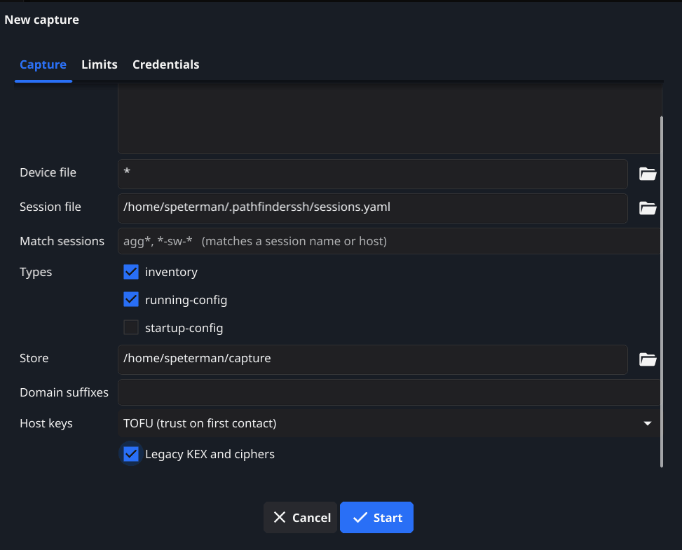
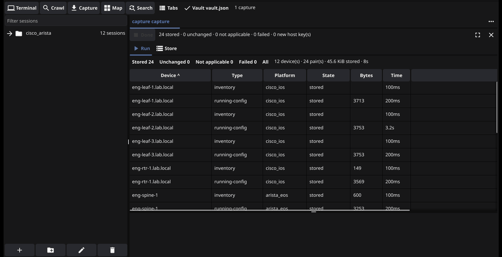
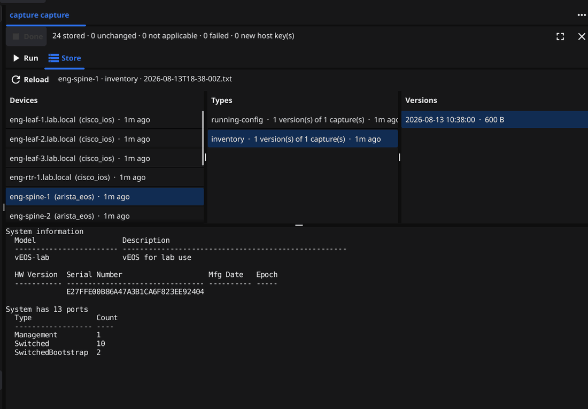

# Capture

A capture reads state from a list of devices and stores it. Configuration
backup is the obvious use, but the design is not configuration-shaped —
anything worth reading on a schedule fits.

Every command a capture can run is on a read-only allowlist that is enforced by
the build. Nothing here writes to a device.

## Capture tab

| Field | What it does |
| --- | --- |
| Devices | Addresses or names, one per line or comma separated. |
| Device file | A file of device names. `#` starts a comment. |
| Session file | Your `sessions.yaml`, as the device source. |
| Match sessions | Globs selecting from that session file, e.g. `*`, `eng-*`, `*-sw-*`. Matches a session name or its host. |
| Types | Which captures to take. Nothing ticked means the default, `running-config`. |
| Store | Directory the captures are written to. |
| Domain suffixes | Suffixes stripped from device names, so one device does not file itself under two. |
| Host keys | Strict or TOFU. **Strict is the default here.** |
| Legacy KEX and ciphers | Allow older key exchanges and ciphers for this run. |

The three device sources are alternatives. Once the tree is populated from a
crawl, **Session file** plus **Match sessions** is the one to use: a glob keeps
meaning the right thing as the estate grows, where a typed list goes stale the
first time a device is added.

Host keys defaults to **Strict**, the opposite of a crawl. A capture works from
a list of devices somebody already administers, so a key nobody has seen before
is a question worth stopping for. A crawl, by definition, is meeting devices
for the first time.

## Limits tab

| Field | What it does |
| --- | --- |
| Concurrency | How many devices are captured at once. |
| Expensive concurrency | A separate, smaller lane for commands marked expensive. |
| Command timeout | How long one command may take. |
| Log progress to stderr | Verbose output. |

Each device is dialled **once** and every selected type is read over that one
session, cheapest first. Expensive commands run in their own narrow lane so one
slow command on one device cannot starve the run.

## Credentials tab

The same fields as a crawl: **Credential tags**, **Username**, **Password**,
**Key file**, **known_hosts**. See [Credentials and the vault](#vault).

## Reading the result

Every row is a **device and type pair**, not a device — one row for
`eng-leaf-1 / running-config`, another for `eng-leaf-1 / inventory`. Each lands
in one of four states:

| State | Meaning |
| --- | --- |
| Stored | The output differed from the last stored version, so a new version was written. |
| Unchanged | Identical to what is already stored. Nothing written. |
| Not applicable | This platform has no command for this type. Not a failure. |
| Failed | The device or the command did not answer. The reason is on the row. |

**Unchanged is the healthy outcome of a schedule**, which is why it is not
reported as a decision. A nightly capture of a stable estate should be almost
entirely unchanged, and a store that grows every night regardless is a store
telling you nothing.

## The store browser

The **Store** tab browses what has been captured: devices, then types, then
versions, with the content underneath.

Files are laid out as `<store>/devices/<device>/<type>/<timestamp>.txt`, with a
per-type history recording every attempt — including the ones that stored
nothing because nothing had changed. It is plain text in ordinary directories,
so anything else you own can read it too.

Comparing two versions of a configuration is comparing two text files. Run it
nightly and the store becomes the answer to "when did this change".
