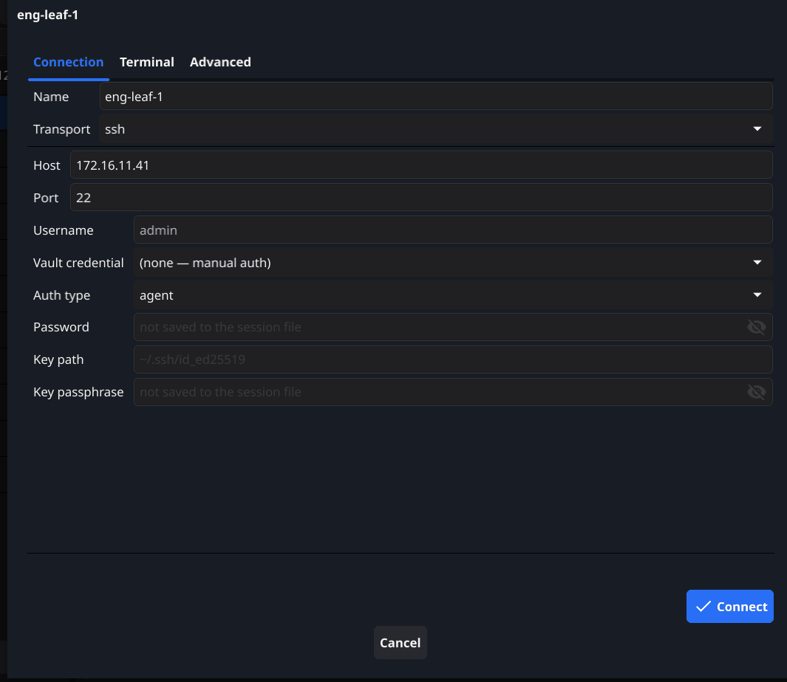
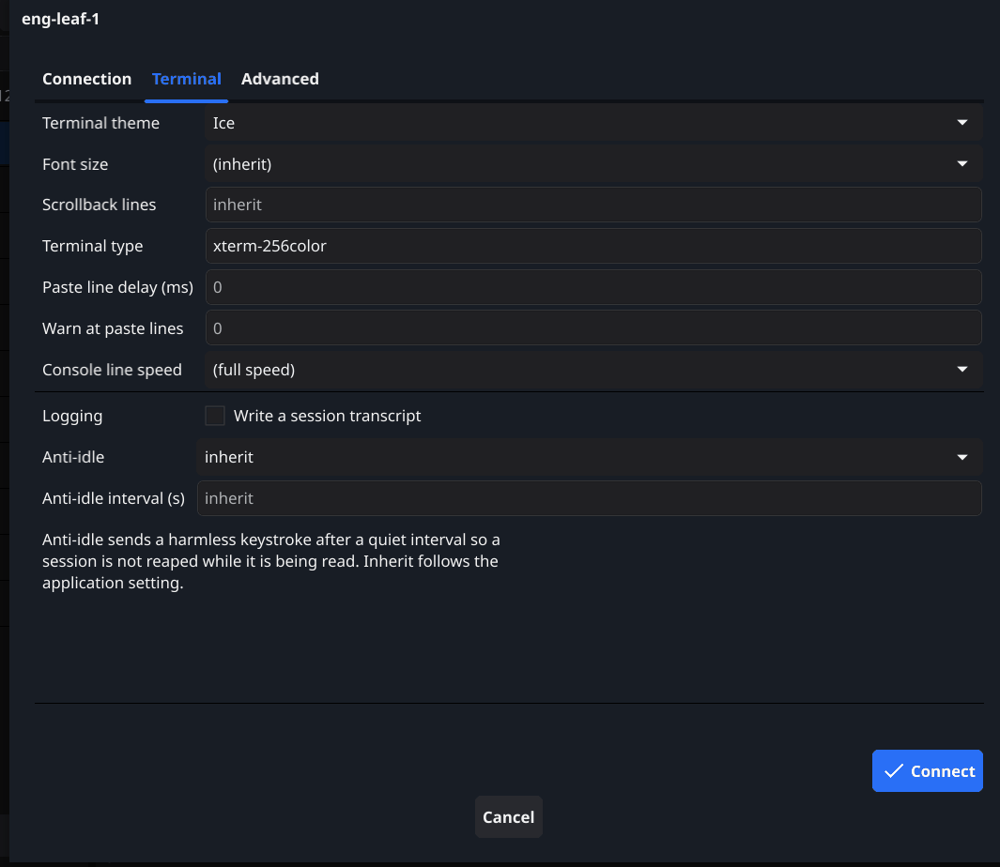
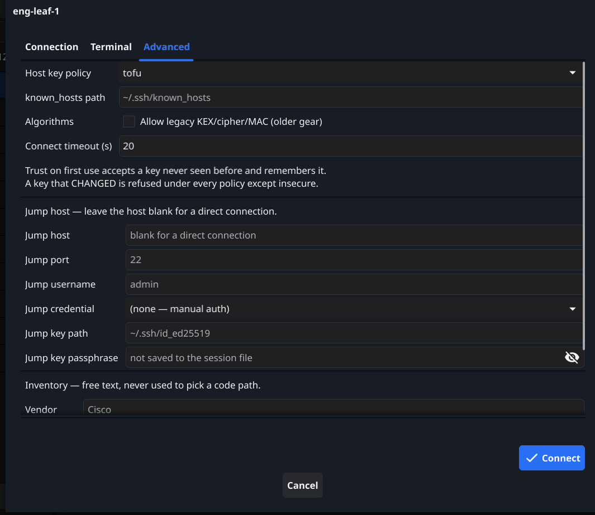

# Sessions and the session tree

A session is one device: how to reach it, how to authenticate, and how its
terminal should behave. Sessions live in a YAML file you can read, diff and
keep in version control.

The tree on the left holds them in folders. The buttons underneath add a
session, add a folder, edit the selection, and delete it. Folders come from
however you think about your network — by site, by role, by customer.

Sessions arrive three ways: typed in by hand, imported from a topology map
after a crawl, or imported from an existing session file. An import **merges**
rather than replaces, so re-importing after a second crawl adds what is new and
leaves what you have edited alone.

## Connection

| Field | What it does |
| --- | --- |
| Name | What the tree and the tab show. Free text; it does not have to match the device's hostname. |
| Transport | `ssh`, `telnet` or `serial`. The fields below change to match. |
| Host | Address or hostname. |
| Port | Defaults to 22 for SSH, 23 for telnet. |
| Username | Login user. Blank falls back to the vault credential, then to your OS username. |
| Vault credential | Use a stored credential instead of typing one. `(none — manual auth)` uses the fields on this tab. |
| Auth type | `agent` uses your SSH agent, `key` a private key file, `password` a password. Agent first, then key, then password is the order attempted. |
| Password | Never written to the session file. It is held for this connection only. |
| Key path | Private key file, for `key` auth. |
| Key passphrase | Also never written to the session file. |

For **serial**, Host becomes **Serial port** and the line settings appear:
Baud, Data bits, Stop bits and Parity. This is the console-cable path, and it
works when nothing else does.

## Terminal

Everything here overrides the application default for this session only.
`(inherit)` and a blank field both mean "use the application setting", which is
what you want almost everywhere — set the exception, not the rule.

| Field | What it does |
| --- | --- |
| Terminal theme | Colour palette for this session's terminal. Independent of the application theme. |
| Font size | Point size. Applies when the tab is opened; an open session keeps the size it measured its grid at. |
| Scrollback lines | How much history the terminal keeps. |
| Terminal type | The `TERM` value sent to the device. `xterm-256color` suits nearly everything. |
| Paste line delay (ms) | A pause between pasted lines. Zero is full speed. |
| Warn at paste lines | Show a confirmation before pasting more than this many lines. Zero disables the warning. |
| Console line speed | Throttles output to a rate a console server can keep up with. `(full speed)` for network connections. |
| Logging | Write a transcript of this session to the transcript directory. |
| Anti-idle | Send a harmless keystroke after a quiet interval so an `exec-timeout` does not reap a session you are reading. |
| Anti-idle interval (s) | How long counts as quiet. |

The paste controls exist because a device is not a text editor. A router
processing a hundred lines of configuration pasted at full speed can drop
characters silently, and the result is a configuration that is subtly not what
you pasted. If you paste blocks into gear that has ever mangled one, set a
small line delay here.

## Advanced

| Field | What it does |
| --- | --- |
| Host key policy | How an unrecognised host key is treated. See below. |
| known_hosts path | Which file host keys are read from and written to. Blank uses `~/.ssh/known_hosts`. |
| Algorithms | **Allow legacy KEX/cipher/MAC** enables key exchanges and ciphers that modern SSH refuses. |
| Connect timeout (s) | How long to wait for the connection to establish. |
| Jump host | Connect through this host first. Blank means a direct connection. |
| Jump port / username / credential / key path / key passphrase | The same authentication choices, for the jump host. |
| Vendor / Model / Device type / Notes | Free text for your own reference. Never used to pick a code path — the platform is detected from the device. |

### Host key policy

**TOFU** — trust on first use — accepts a key it has never seen and remembers
it. **Strict** requires the key to already be known.

Both refuse a key that has **changed**. That is the case that matters: a
changed key is the one that might be an interception, and every policy except
`insecure` stops for it. TOFU only relaxes the first meeting, which for a
network you administer is a device you have simply not connected to yet.

### Legacy algorithms

Off by default, and available per session. Older network equipment negotiates
key exchanges and ciphers that current SSH implementations no longer offer, and
the failure reads as "no matching key exchange method found". That gear is
still in service, still needs configuring, and often needs it most when
something is broken.

Turning this on for the sessions that need it is a deliberate, per-device
decision. That is why it is not a global default.
