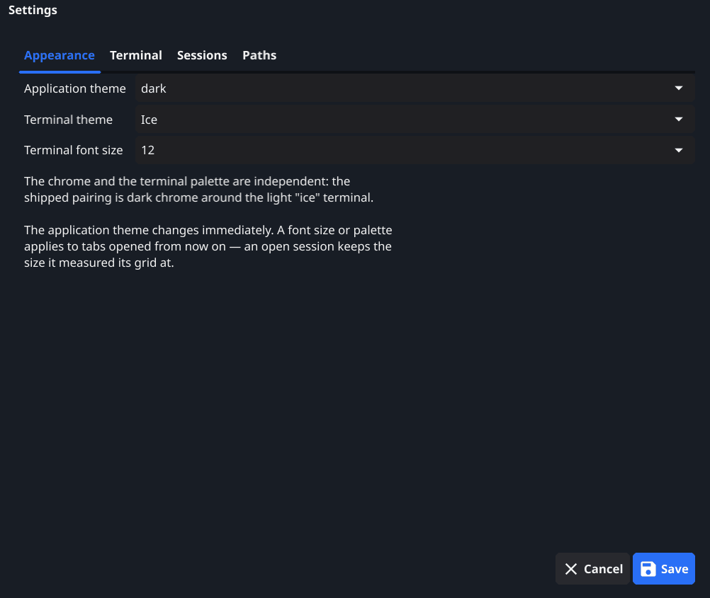
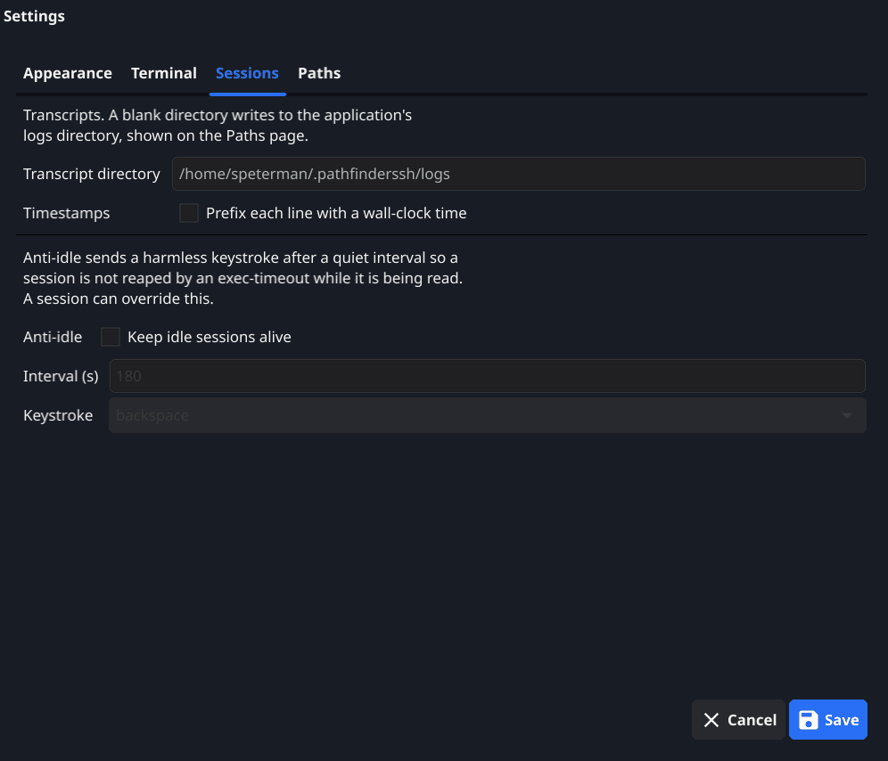

# Settings

**File → Settings** holds the values that apply to the application regardless
of which session is in front. It is deliberately short.

A setting that appears in two places is a setting that will eventually disagree
with itself, and the person looking at the one that did nothing has no way to
know which one won. So:

- Per-session overrides are on the session, not here.
- Crawl and capture parameters are on their launch dialogs, because a run's
  settings are part of that run.
- Credentials are in the vault.

Anything set here is what a session inherits when its own field says
`(inherit)` or is left blank.

## Appearance

| Field | What it does |
| --- | --- |
| Application theme | The window chrome: dark or light. |
| Terminal theme | The terminal's colour palette. |
| Terminal font size | Default point size for terminals. |

The chrome and the terminal palette are independent — the shipped pairing is
dark chrome around the light "ice" terminal, and any other combination is
equally valid.

The application theme changes immediately. A font size or a palette applies to
tabs opened from then on: an open session keeps the size it measured its grid
at, because a terminal's dimensions in rows and columns are what the far end
was told, and changing them underneath a running program is how output ends up
in the wrong place.

## Terminal

Defaults for every session: scrollback lines, paste line delay, warn at paste
lines, and console line speed. Each is described in
[Sessions](#sessions-terminal); the values here are what a session inherits.

## Sessions

| Field | What it does |
| --- | --- |
| Transcript directory | Where session transcripts are written. Blank uses the application's logs directory. |
| Timestamps | Prefix each transcript line with a wall-clock time. |
| Anti-idle | Keep idle sessions alive. |
| Interval (s) | How long a session may be quiet before the keystroke is sent. |
| Keystroke | Which harmless keystroke to send. |

Anti-idle exists for `exec-timeout`. A device configured to reap idle sessions
cannot tell the difference between a session nobody is using and a session
somebody is reading, and it will close the one you are halfway through reading.
A single harmless keystroke after a quiet interval prevents that. A session can
override this.

Transcripts are the other half of the same problem: a record of what was on the
screen, written as it happens, for when "what did it actually say" comes up
afterwards.

## Paths

Read-only, and not really a setting. It shows the files this run actually
resolved — the settings file, the vault, the session file, the application home
— with a **Copy paths** button.

"My credentials aren't there" and "where did my transcript go" are the same
question: which file is this actually using. This page answers it, which is
different from the question of which file it ought to be using.
